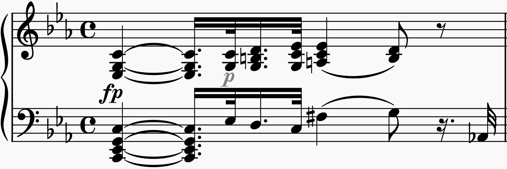
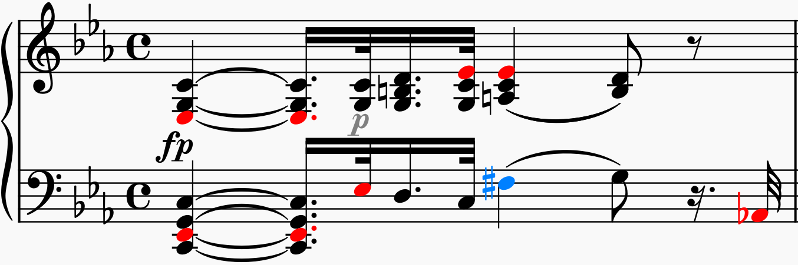

# Alter Colour

`AlterColour` should make reading sheet music a bit easier by colouring the notes that have been alterer in pitch sthrough sharps or flats, for most music corresponding to the black keys on the piano.

## Background

For instance, Ludwig van Beethoven, Sonate №8, “Pathétique”, Opus 13, 1st Movement, 1st bar:



Colouring the flats blue and the sharps red shows which notes are altered in what way.



`Altercolour` also handles double sharps and double flats.


## Installation

### MuseScore 3.x

TODO

### MuseScore 4.x

Install the `altercolour` folder in your MuseScore Plugins directory and enable it with `ManagePlugins` from the Plugins menu. 

## Usage

AlterColour is derived from the `AlterColor` but does not toggle the colour; by selecting `Altercolour` all notes whose pitch is altered by a symbol, implicityly or as accidental, will be coloured. 


## Colour scheme

The default colour scheme leans on physics of light in the sense that lower frequency become red (flats), and higher frequencies become more blue (sharps). If you want to change the colour scheme, it's defined near the top of `altercolour.qml`.

```qml
    property string natural:     "#000000" // black
    property string doublesharp: "#00ffff" // cyan
    property string sharp:       "#0080ff" // blue
    property string flat:        "#ff0000" // red
    property string doubleflat:  "#ff0080" // magenta
```

Eventually, it would be desirable to have a colour selection for the user.