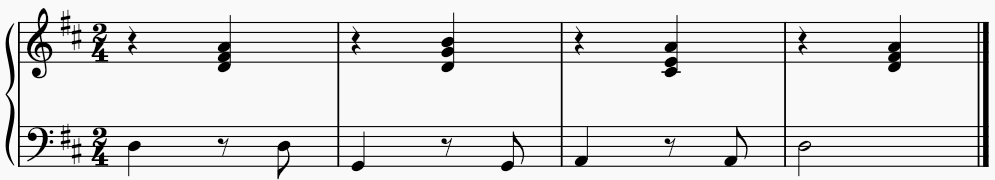

# MuseScore Baiscs

The objective of this document is to capture some basic MuseScore concepts for representing scores and some of its constituents such as but not limited to measures (bars) or notes. This information was derived partly from documents such as [MuseScore internal score representation](https://musescore.org/en/developers-handbook/references/musescore-internal-score-representation) and [Design & implementation](https://musescore.org/en/developers-handbook/references/design-implementation) as well as from source code on the github [Musescore](https://github.com/musescore/MuseScore) repository.

# A Sequence of Musical Events

What is a score in music? Let me start by quoting [Alan Bennett](https://en.wikipedia.org/wiki/Alan_Bennett)'s [The History Boys](https://en.wikipedia.org/wiki/The_History_Boys), so well captured in the [2006 film adaptation](https://www.imdb.com/title/tt0464049/):

<blockquote>
Mrs. Lintott: Now. How do you define history Mr. Rudge?

Rudge: How do I define history? It's just one fuckin' thing after another.
</blockquote>

That said, a musical score is perhaps just one musical item after another. For instance, the sequence of a few such musical items in a piano score with a treble and bass clef.

This piano score displays a D-major key, a 2/4 timing signature, four bars with a simple sequence of base notes and treble chords. It is understood that these musical items or events are to be performed one after each other, as read from left to right, in their prescribed duration as a sequence of musical events.

# Score Time Discretisation

It is conceivable to represent the score as a sequence of musical "items", each at a specified time, and sometimes several items of different kinds at the same time. In MuseScore,  an item is abstraced into something called `Segment`; it reflects all musical elements that occur across all staves for the same moment in time; a `Segment` may even have child elements that all belong together for that time and it exposes certain properties depending on its kind either directly or indirectly:

- which staff if pertains to,
- is it a rest or a chord, a time signature or a clef,
- if a chord, for each note the pitch and duration, for a rest the duration,
- annotations such as markings like staff text, chord symbols, dynamics.

In MuseScore, these `Segment`s can only occur at discrete times, at the temporal discretisation of 480 `ticks` per ¼ note: the duration of ¼ note is quantised into 480 tiny steps. Why 480? Prime factorisation reveals that `480 = 2 x 2 x 2 x 2 x 2 x 3 x 5` which means that a ¼ note could still be split by a factor of 32 down to a 1/128 note, and that duration again into a dotted 1/128 note, or split into a tripplet or quintrupplet! 

Think of the representation as a conceptual timeline, like a washing line, where musical items can be attached at discrete times, at integral multiples of the tick time, the smallest duration, `1/480` of a ¼ note. Once a playback speed is chosen as beats-per-minute (BPM) to a ¼ note, the tick frequency becomes 480 * BPM/60 = 8 * BPM Hz. For instance, at 120 BPM, the tick frequency would be 960Hz, i.e. about 1ms duration per tick.

# MuseScore Object Model

There are many ways to skin a cat, or slice and dice information. For instance, it is conceivable to simply store all `Segment`s of a score in a `map` with the keys being the absolute `tick` times (if something is happening at that `tick`) and the corresponding values being a collection of `Segment`s for the corresponding ticks. It would equally be conceivable to use a `Score` that contains `Stave`s that contains `Measure`s (at a start tick) that contains `Segment`s (with relative ticks), etc. MuseScore has chosen the following approach at the current version on [github](https://github.com/musescore/MuseScore).

At the heart and top is the `Score`; it contains in essence `measures` of type `MeasureBaseList` which in turn contains a `tickIndex` which maps ticks to collections of `MeasureBase` objects (which comes as `Measure` proper or as `Box`); there can be only one proper `Measure` per tick but several `Box`es. In addition, the `Score` keeps information about `Staff`s (one staff for each instrument usually) and `Part`s as well as housekeeping information for editing and layout such as `Page`s and `System`s.

Another important concept is that every musical item is in one or other way an "element", or in code an `EngravingItem`, the "the virtual base class of all score layout elements", derived from `EngravingObject` which can be of various `ElementType`s, from `STAFF` over `MEASURE` and `SEGMENT` down to `NOTE`; every item _is_ an element, an `EngravingItem`, and most importantly can contain other elements, directly or indirectly through references to others. So an object hierarchy is created where every child also maintains a reference to its parent.

So where are the notes? Every `Measure` contains segments as `SegmentList` which is a container for `Segment` objects; the list offers all kinds of traversing the segments, from first to last. In turn, a `Segment` can be of various kinds defined in `SegmentType`, a timing signature, a clef, a barline or most importantly, a so-called `ChortRest` which is the common base for `Chord`s and `Rest`s. Finally, the `Chord` contains a vector of `notes`, a collection of references to `Note` object which contains more elements such as dots, and properties such pitch or pitch class.

It is important to mention that all `Note`s on a `Chord` have the same duration; hence duration is a `Chord` property. However, each of its `Note`s is assigned to one of 4 different voices on a staff. Together with the staff index, each note is hence associated with a track identified by the track index, i.e. the combination of staff index and voice as `staffIindex * VOICES + voiceIndex` where `VOICES` is hard-coded to be 4. Conversely, the voice index is `track % VOICES` and the staff index = `track / VOICES`.

# Slicing and Dicing

In Musescore's _direct_ object hierarchy of the current code base certain objects own collections of other objects, and some objects maintain references to objects. This allows creating of various representations that have to be kept consistent. For instance, the `staffIdx` is a property of the `EngravingItem`; since `Segment`, `ChortRest`, `Chord` and `Note` are all `EngravingItem`s, then the concrete note object in the concrete chord in the concrete segment have all to share the same staff index. Or, each `Measure` is kept for a certain tick, and yet each `Segment` in a concrete measure also exhibits a tick property; they are not completely independent.

On the upside, a score can be traversed in various ways. It should be possible to traverse all staffs, then in each staff all measures, and in a measure all segments, and there all voices. Alternatlively, in should be possible to traverse all segments in the score directly independently of measures, and then query the `elementAt` for every track of each segment. The more natural way (close to the source code) seems to be to traverse measures, then segments, and then based on the latter's type, process each segment where all happens at the same time across staffs & voices.

TODO: IMAGE walk of example