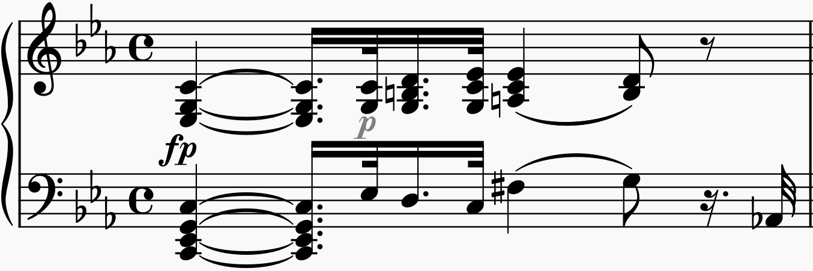
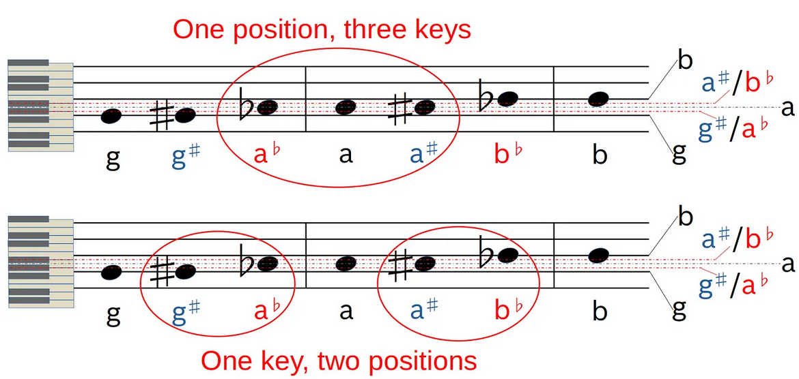
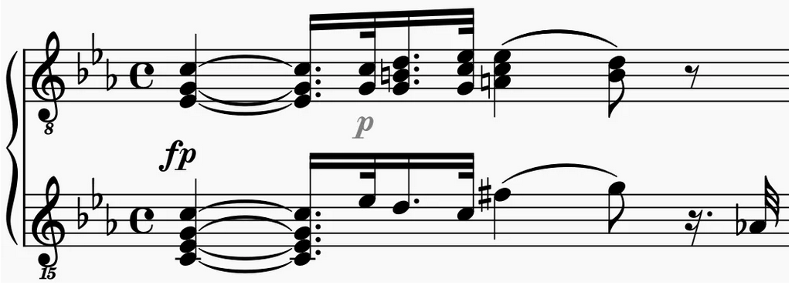
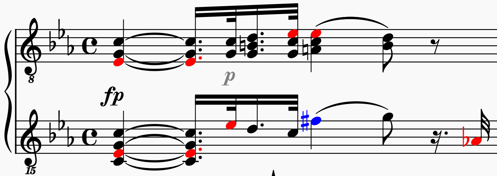
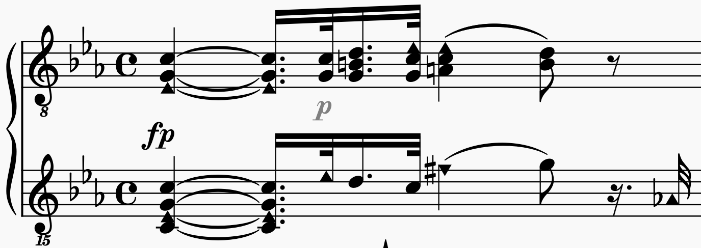
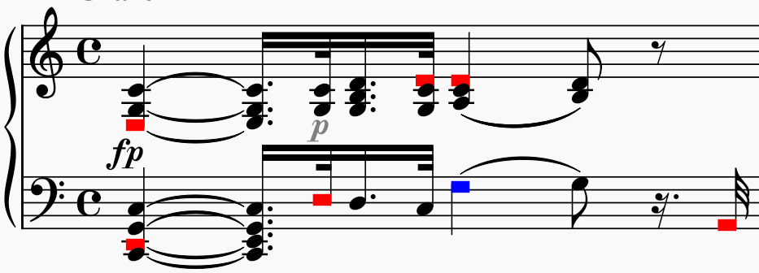
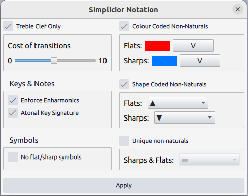

# Simplicior

The objective of `Simplicior` is to make sheet music a bit simpler, less complex, and hence sight-reading, too. Based on [Reducing the Cognitive Load in Reading Piano Sheet Music](https://medium.com/@peter-wurmsdobler/reducing-the-cognitive-load-in-reading-piano-sheet-music-a513aba01304), this plugin allows nearly any combination of the following options:

- use only one clef class (treble) throughout with adaptive octave offsets to minimise ledger lines and keep notes mostly within a staff while avoiding too many transitions;
- use only notes that represent the 12 tones in a chromatic scale of equal temperament, no double flats or double sharps, i.e. enforce enharmonic notes;
- use only the atonal signature, equivalent to C-major, to represent a score as if it was written in C-major and present all non-C-major notes as accidentals;
- primary notes (white keys on the piano, equivalent to C-major) that are altered in pitch through sharps or flats (and become black keys on the piano), change note-head colour and/or shape, but keep their position;
- alternatively, primary notes that are altered in pitch through sharps or flats and end up being tonally equivalent are represented by one unique note-head (and colour), but set at a common position;
- optionally, if sharp or flat symbols (as well as the natural symbols in a key) become redundant due to colour or shape encoding, do not show these symbols.

## Notation issues

Western musical notation evolved over more that 1000 years, as described in [European Music Notation: History, Deficiencies and Alternatives](https://peter-wurmsdobler.medium.com/european-music-notation-history-deficiencies-and-alternatives-2684fd947aee); it accommodates all kinds of music and as such is as complex as it needs to be. 
For instance, Ludwig van Beethoven, Sonate №8, “Pathétique”, Opus 13, 1st Movement, 1st bar shows the use of sharps and flats in the key of C minor (3 flats):

The ambiguity of traditional notation is obvious: one position on the staff can mean three different notes (and keys), or one key can be represented by two different positions (and notes), depending on key signature as shown below:

## Mitigation

For some applications, this notation could be adapted and small modification could address some shortcomings while remaining compatible with the traditional notation system. They could lower the entrance barrier and reduce the cognitive load on our brain.

### One Clef Class Only

The simple rule is to use only one clef, the treble clef as it is the most common. Since it is always difficult to read notes on ledger lines, additional shift the affected bars by the necessary number of octaves into a more legible area inside the staff, without switching offsets too often (a balance to be had).

### Colour-Coded Non-Naturals

If a piece is written with sharps or flats (non-naturals), an affected note later down the staff on a line or space does not sound as written at that point, something hard to keep in mind for a beginner. Colouring those flats and sharps shows which notes are altered in what way:

### Shape-Coded Non-Naturals

Alternatively, or in addition to colouring non-naturals (including accidentals), those notes can be encoded through shape and position in a configurable manner. This allows a unique one-to-one mapping between symbol and note (tone), hence helping the mind to read: 

### All the way: no accidentals nor key

Once the colour or shape already encodes the fact that a note is sharp or flat, i.e. none of the white keys of the piano keyboard, then the key signature and accidental signs become redunant. The piece can be seen as being written in an atonal way (or C-major) with all notes deviating from a C-major scale being marked:

## Installation

### MuseScore 3.x & 4.x

Install by copying the `Simplicior` folder into your MuseScore Plugins directory, then enable it with `ManagePlugins` from the MuseScore Plugins menu. 

## Usage

Selecting `Simplicior` from the MuseScore plugins menu opens up a dialogue window:

## Limitations

There you can select the combination of simplifications to be carried out on the selected score, staff(s) or measure(s). Currently there are some limitations :

- The "Treble Clef Only" options does carry out the analysis and computes an ideal sequence of clefs; however, these clefs cannot be set through the plugin API (yet).
- The "Atonal Key Signature" does in principle go through all measures and attempts to set the key signature to "atonal"; however, these key signature cannot be set through the plugin API (yet).

## Know issues

- If no selection was made, the plugin should internally select all and after completion deselect all. For some reason this does not work yet.
