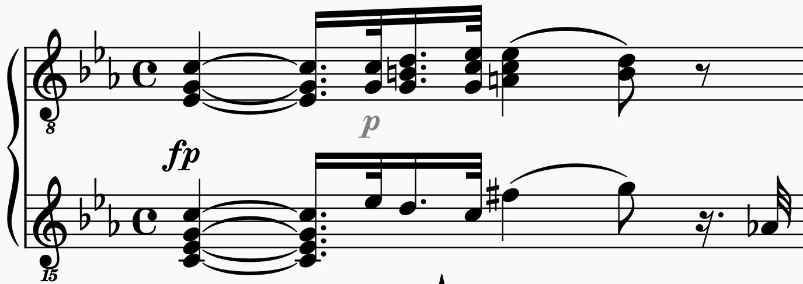
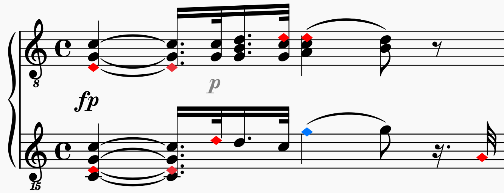

# Simplicior

The objective of `Simplicior` is to make sheet music a bit simpler, less complex, and hence sight reading, too. Based on [Reducing the Cognitive Load in Reading Piano Sheet Music](https://medium.com/@peter-wurmsdobler/reducing-the-cognitive-load-in-reading-piano-sheet-music-a513aba01304), this plugin allows a combination of:

- use only one clef class throughout for all voices width adaptive octave offsets in order to minimise ledger lines and keep notes mostly within a staff;
- don't use double sharps or double flats and simply use the enharmonic equivalents, i.e. force the affected notes to be cast as their harmonic equivalent;
- primary notes (white keys on the piano) altered in pitch through sharps or flats (black keys on the piano):
  - change notehead colour (configurabl), e.g. red for flats, and blue for sharps,
  - change notehead shape and position, e.g. square and slightly offset.

## Notation issues

Western musical notation evolved over more that 1000 years, as described in [European Music Notation: History, Deficiencies and Alternatives](https://peter-wurmsdobler.medium.com/european-music-notation-history-deficiencies-and-alternatives-2684fd947aee); it accommodates all kinds of music and as such is as complex as it needs to be. 
For instance, Ludwig van Beethoven, Sonate №8, “Pathétique”, Opus 13, 1st Movement, 1st bar shows the use of sharps and flats in the key of C minor (3 flats):

The ambiguity of traditional notation is obvious: one position on the staff can mean three different notes (and keys), or one key can be represented by two different positions (and notes), depending on key signature as shown below:

## Mitigation

For some applications, this notation could be adapted and small modification could address some shortcomings while remaining compatible with the traditional notation system. They could lower the entrance barrier and reduce the cognitive load on our brain.

### One Clef Class Only

The simple rule is to use only one clef, the treble clef as it is the most common. Since it is always difficult to read notes on ledger lines, additional shift the affected bars by the necessary number of octaves into a more legible area inside the staff, without switching offsets too often (a balance to be had).

### Colour-Coded Non-Naturals

If a piece is written with sharps or flats (non-naturals), an affected note later down the staff on a line or space does not sound as written at that point, something hard to keep in mind for a beginner. Colouring those flats and sharps shows which notes are altered in what way:

### Shape-Coded Non-Naturals

Alternatively, or in addition to colouring non-naturals (including accidentals), those notes can be encoded through shape and position in a configurable manner. This allows a unique one-to-one mapping between symbol and note (tone), hence helping the mind to read: 

### All the way: no accidentals nor key

Once the colour or shape already encodes the fact that a note is sharp or flat, i.e. none of the white keys of the piano keyboard, then the key signature and accidental signs become redunant. The piece can be seen as being written in an atonal way (or C-major) with all notes deviating from a C-major scale being marked:

## Installation

### MuseScore 3.x & 4.x

Install by copying the `Simplicior` folder into your MuseScore Plugins directory, then enable it with `ManagePlugins` from the MuseScore Plugins menu. 

## Usage

Selecting `Simplicior` from the MuseScore plugins menu opens up a dialogue window:

There you can select the combination of simplifications to be carried out on the selected score, staff(s) or measure(s):

- Enforce Enharmonic: this means in essence that there only 12 notes in a chromatic scale, on a piano seven white keys and 5 black keys. All notes such as double sharps or double flats or some sharps and flats will be resolved to their simplest representation, e.g. a C## is simply a D.
in case the colour option is selected, choose the colour for flats and sharps,
- Treble Clef Only: Optimise the score per staff such that a teble cleff (with necessary offsets in octaves) is chosen to keep all notes in a measure close to the centre of the staff (B2, B3, B4 or B5) while also minimising too many changes of clef along a staff. A cost is attributed to such changes. No cost will allow to change clef at every measure if necessary, max cost will minimise the cleff changes.
- Colour-encoded non-naturals: all non-naturals, i.e. black keys on the piano, will be colour coded, choose the colour for flats and sharps.
- Shape-encoded non-naturals: all non-naturals, i.e. black keys on the piano, will be shape coded, i.e. will be square note heads.
- No accidental symbols (only with shape encoded non-naturals): in this case the key will be set to C-major (or atonal), i.e. all non-naturals will be marked with an accidental first. Then all resulting accidentals will be shown in square noteheads.